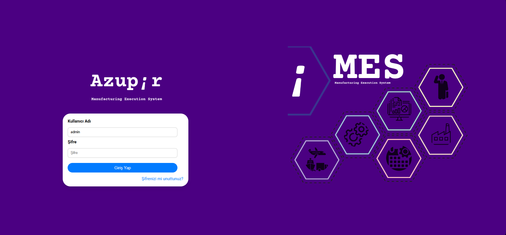
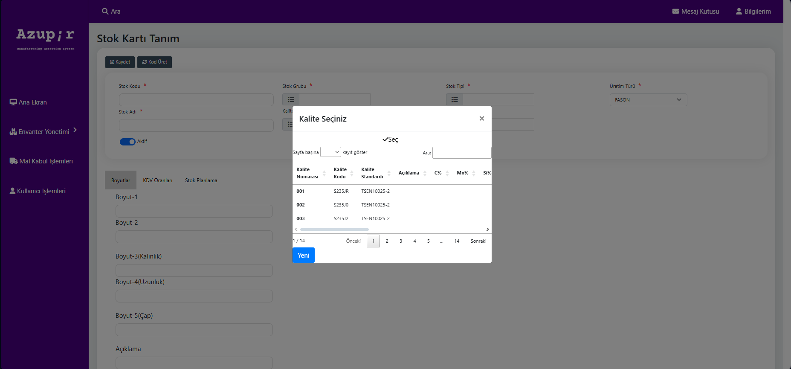
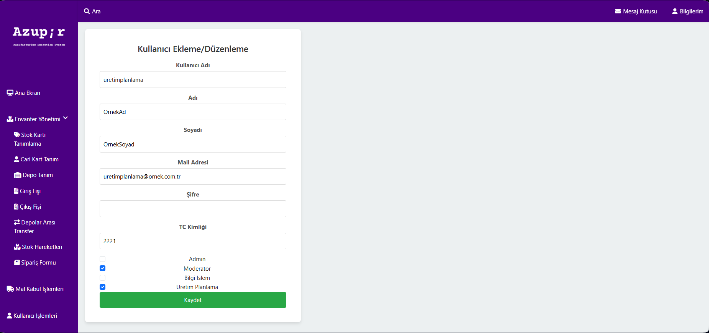
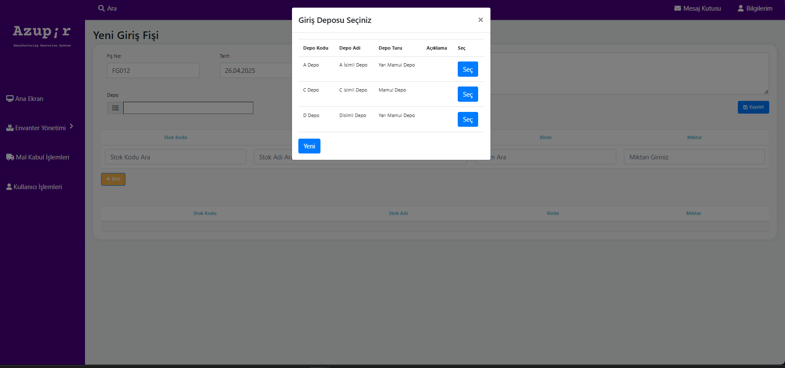
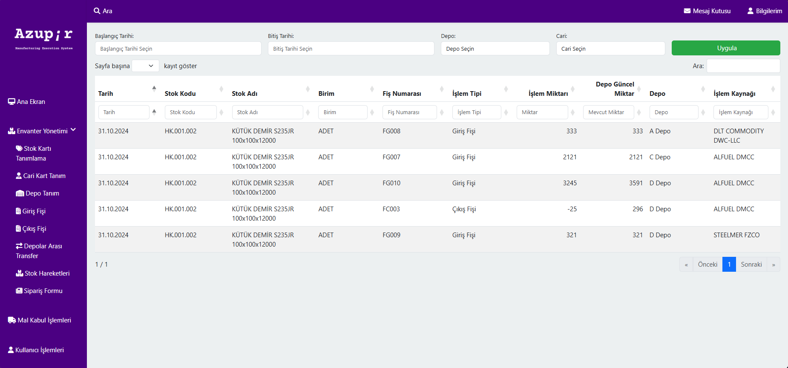

Azupir - Inventory Management System (Staj Projesi)
**Proje Hakkında**

- Azupir, üretim yönetim sistemi kapsamında envanter yönetimi, depo işlemleri, mal kabul işlemleri, stok hareketleri, kullanıcı işlemleri gibi çeşitli işlemleri yönetebileceğiniz bir platformdur. Bu projeyi bir .NET Core MVC uygulaması olarak geliştirdim.

**Login Ekrani:**

**Proje Özellikleri**

**Envanter Yönetimi:**

- Stok Kartları: Stokların tanımlanması, aktif/pasif hale getirilmesi.

- Stok Kodu, Stok Adı, Birim, Stok Tipi, Üretim Türü gibi alanlarla tanımlamalar yapılabilir.

**Kullanıcı Yönetimi:**

- Kullanıcılar için ekleme, düzenleme, silme işlemleri yapılabilir.

- Kullanıcıların farklı rolleri bulunur: Admin, Moderator, Bilgi İşlem, Üretim Planlama.

**Depo Yönetimi:**

- Depo ekleme ve düzenleme işlemleri yapılabilir.

- Depo türü ve açıklama gibi bilgilerle yeni depo tanımları yapılabilir.

**Stok Hareketleri:**

- Stok hareketleri, giriş ve çıkış fişleriyle takip edilebilir.

**Teknolojiler**

- Backend: .NET Core MVC

- Frontend: HTML, CSS, JavaScript, Bootstrap

- Veritabanı: MYSSQL Server
